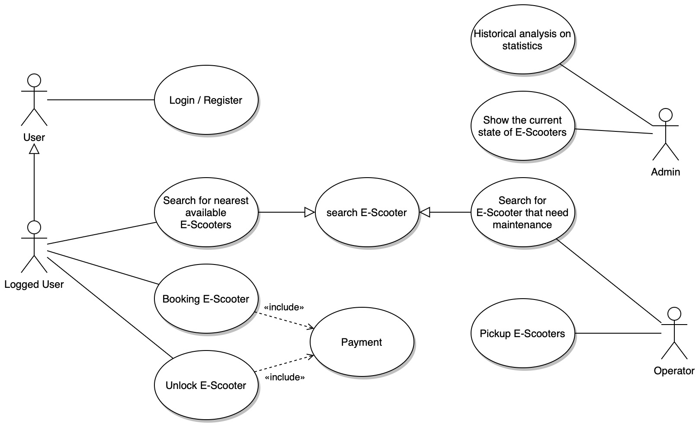
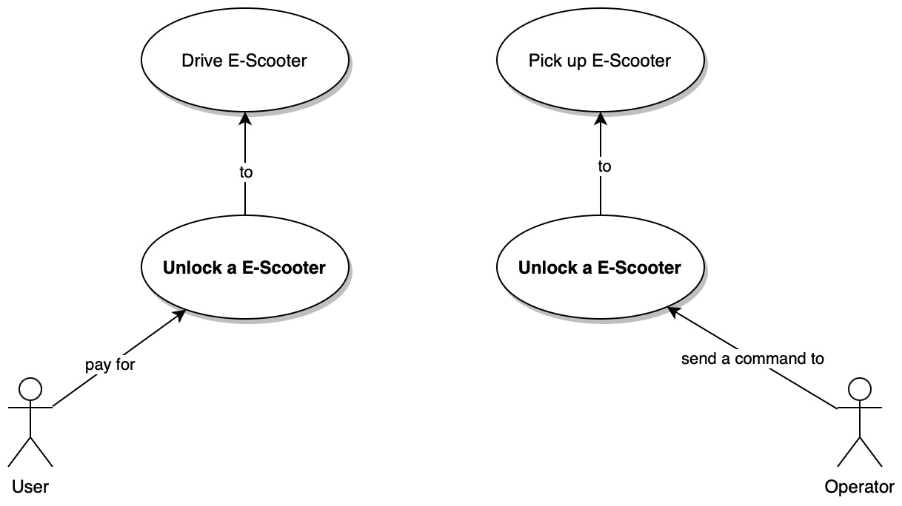

# E-Scooters

## Use cases



## User stories

### User

```text
As a user,
I want to be able to register,
so that I can log in to the system.
```
    
```text
As a logged user,
I want to book an e-scooter,
so that I can use it when I need it.
```

```text
As a logged user,
I want to be able to unlock the e-scooter that I've found,
so that I can use it.
```

```text
As a logged user,
I want to be able to pay with my credit card,
so that I can use the service.
```

### Operator

```text
As an operator,
I want to be able to search for e-scooters that need to be maintained,
so that I can pick them up and possibly check them.
``` 

```text
As an operator,
I want to be able to search for e-scooters that need to be charged,
so that I can pick them up and charge them.
```

```text
As an operator,
I want to be able to unlock the e-scooter that I've found,
so that I can pickup it.
```

### Admin

```text
As an admin,
I want to be able to check the actual usege of e-scooters,
so that I can plan the maintenance and charging.
```

```text
As an admin,
I want to be able to look at statistics of the usage of e-scooters,
so that I can analyze them.
```

## Domain stories and Event storms

The domain stories with events storm board clarify the domain model and the use cases.



An example is that, both **users** and **operators** can unlock e-scooters but, while users can unlock only the e-scooters before a payment, operators can unlock any e-scooter in order to pick up and check it.

Given that, the domain model should have two different entity, a `User` and a `Operator`, that can unlock an e-scooter, but with different constraints and different goals.

## Quality attribute scenarios
